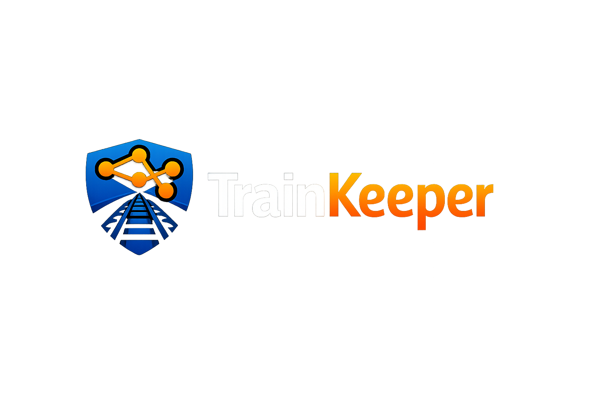
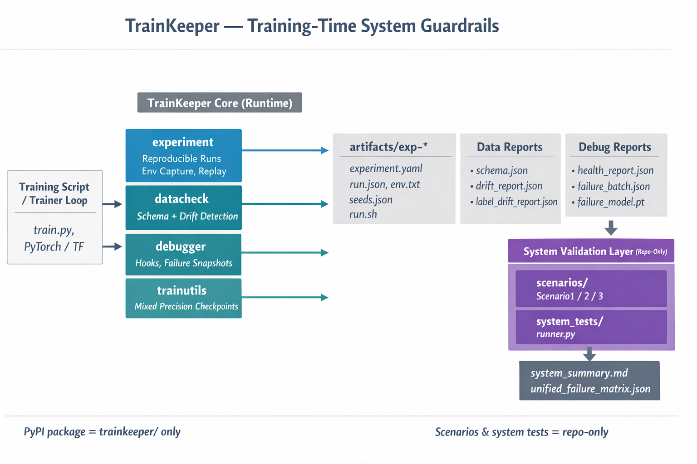

# 
# TrainKeeper

**TrainKeeper** is a minimal-decision, high-signal toolkit for building reproducible, debuggable, and efficient ML training systems. It adds guardrails **inside** training loops without replacing your existing stack.

## ⚡️ Key Features

- **Reproducibility**: deterministic seeds, environment capture, replay
- **Data integrity**: schema inference, drift detection
- **Distributed Training**: Zero-code DDP/FSDP support
- **Optimization**: GPU memory profiling, smart checkpointing
- **Dashboard**: Interactive experiment tracking

## 🚀 Quick Start

```python
from trainkeeper.experiment import run_reproducible

@run_reproducible(auto_capture_git=True)
def train():
    # your training code
    print("TrainKeeper is running.")

if __name__ == "__main__":
    train()
```

## 📦 Installation
```bash
pip install trainkeeper
```

## 🔗 How it works

